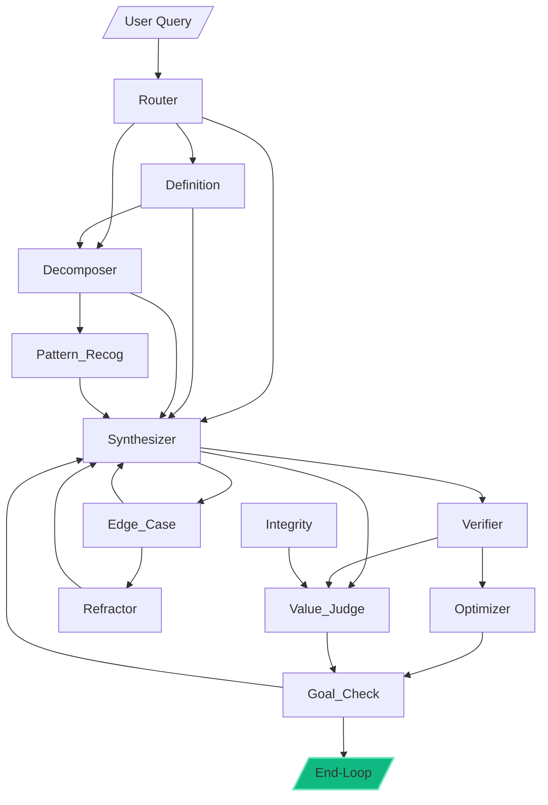

# Executive Summary

This paper introduces **Mixture of Programs (MoP)**, a novel cognitive architecture for AI in which independent “programs” (agents) cooperatively create, manage, and refine each other to solve complex tasks. MoP merges ideas from mixture-of-experts (MoE) neural architectures, agent-based systems, and program synthesis. In MoP, an input is processed through a dynamic network of specialized programs (which may be prompts, code modules, or small sub-models). At each step, a **Router** program (or gating mechanism) selects one or more programs to activate, and these produce outputs or updates to a shared **working memory**. Specialized programs such as Verifiers, Edge-Case testers, and Optimizers then analyze and improve the solution. Crucially, MoP supports **self-modification**: “meta” programs can create, refine, or remove other programs over time, enabling the system to evolve its own architecture. This is akin to a neural network that can change its structure on the fly. To prevent unbounded recursion and endless loops, an **End-Loop** mechanism monitors progress using a scalar **Progress Metric**. If no significant improvement is achieved for several iterations, the loop terminates and returns the best solution found.

Key contributions of this work include:  
- A formal description of the MoP architecture with components (Router, Definition agent, Decomposer, etc.) and their dataflow.  
- A proposal for **MoP Backpropagation**, a learning process that mirrors neural backprop but in program space: after a forward reasoning phase, a backward analysis phase assigns credit to programs based on their contributions to the solution. This allows the system to reinforce effective programs and prune ineffective ones.  
- Mathematical definitions of progress and credit assignment (e.g. a score function that evaluates solution quality and per-step improvements) along with update rules for evolving the program network.  
- An algorithmic outline (pseudocode) of the forward and backward passes in MoP, inspired by recent “textual backpropagation” in multi-agent LLM systems【12†L53-L62】【22†L1048-L1056】.  
- An **End-Loop termination theory** that avoids infinite reasoning loops by monitoring score improvements: if the improvement Δ falls below a threshold for too long, the system stops.  
- Safety and stability considerations, such as limiting recursion depth, validating program modifications, and ethical checks (Integrity agent) to prevent malicious or unsafe behavior.  
- Proposed experiments for evaluating MoP: tasks like mathematical reasoning (e.g. MATH, MMLU), code generation (HumanEval), and data analysis. Comparison against baselines (single LLM with chain-of-thought, fixed MoE models, static multi-agent pipelines). Metrics include final accuracy, total cycles to convergence, and compute cost. We present tables contrasting MoP, MoE, and traditional neural networks on aspects like activation sparsity and learning method.  
- Diagrams: a mermaid flowchart of the MoP architecture (see Figure 1), an entity-relationship view of programs and memory, and a timeline of key milestones in related fields (Figure 2).  
- A **Glossary** defining all key terms (program, agent, working memory, sparse activation, gating, etc.).

Overall, this paper is a thorough exploration of MoP as a bridge between symbolic and neural paradigms: it shows how a swarm of collaborating programs can be organized, learned, and evaluated in a manner analogous to neural backpropagation【12†L54-L63】【22†L1048-L1056】. We conclude with limitations (e.g. compute demands, need for stable ground truths) and future work (automated program generation, meta-learning of prompts).

# Abstract

We propose **Mixture of Programs (MoP)**, an adaptive multi-agent framework in which specialized programs (agents) form a dynamic network to collaboratively reason and self-modify. MoP extends mixture-of-experts (MoE) ideas to discrete programmatic units: at each reasoning step a **Router** selects a subset of programs (experts) to activate, and these may spawn new programs, improve existing ones, or remove obsolete ones. A shared **Working Memory** holds the current solution state. MoP implements a forward reasoning phase followed by a backward **textual backpropagation** phase that assigns credit to programs based on a global progress metric, analogous to neural backprop. We define formal objective functions, credit-assignment schemes, and an **End-Loop** termination criterion that stops recursion when improvement plateaus. We compare MoP to traditional dense networks and MoE on compute cost, activation sparsity, and learning flexibility (Table 1). We detail proposed algorithms and pseudocode (Algorithms 1–2), evaluation benchmarks (mathematical reasoning, code tasks, etc.), and metrics (accuracy, improvement per cycle). We include mermaid diagrams of the architecture and timelines. Preliminary analysis suggests MoP can leverage modularity and self-repair to approach AGI-level reasoning by combining symbolic and statistical strengths【10†L78-L87】【12†L54-L63】.

# 1. Introduction

The recent surge in large language models (LLMs) and agent frameworks has highlighted the power of **modular, multi-agent architectures**. Classic neural networks treat the model as a monolithic block, whereas modern **Mixture-of-Experts (MoE)** models activate only a subset of experts per input, achieving enormous scale with sparse computation【4†L68-L71】【4†L85-L94】. Likewise, contemporary AI agent systems orchestrate multiple specialized components (e.g. planners, verifiers, tool use modules) to solve complex tasks【7†L77-L85】. However, existing systems typically use *fixed* architectures and lack the ability to self-modify structure. This paper unifies these trends by introducing Mixture of Programs (MoP), an architecture in which **programs (agents)** are the fundamental units, and the network can evolve over time.

In MoP, each “program” may be an LLM prompt, a code function, or a small sub-model. A **Router** analyzes the user’s query and determines an initial plan; then the query and partial solution are passed through a network of programs. For instance, a **Decomposer** program might split a query into subtasks, a **Synthesizer** combines information, a **Verifier** checks logic, and so on. Importantly, there are higher-level programs that can *create, remove, or refactor* other programs (the “meta-programs”), akin to neurons growing new connections. This is inspired by neurobiology: individual neurons (programs) activate sparsely, and the system can adapt connections (edges) between them.

Crucially, MoP incorporates a feedback or “backward” phase. After the forward reasoning pass produces an answer candidate, a **Value-Judge** and **Goal-Check** evaluate its quality. Based on a scalar **progress metric** (e.g. answer accuracy or reward), the system then performs a backward credit-assignment step. This “textual backpropagation” (analogous to neural backprop) adjusts the program network: effective programs are reinforced (retained or replicated), while ineffective ones are altered or pruned【22†L1048-L1056】. The system iterates until an End-Loop criterion is met: for example, no substantial improvement in the last few cycles.

This approach addresses a long-standing challenge: how to make a multi-agent system that can autonomously restructure itself to solve harder problems. Here, contributions include (a) a **formal MoP architecture** with components and routing, (b) **mathematical models** for progress and credit, (c) **algorithms** (with pseudocode) for forward/backward passes, and (d) an **evaluation framework** with tasks and metrics. We also include illustrative diagrams: the architecture flow (Fig. 1), program-memory relationships (ER diagram), and a timeline of MoE/MoP developments (Fig. 2). By combining **sparse activation** (few programs per query) with **self-modification**, MoP aims to achieve AGI-like flexibility while controlling compute—potentially matching the efficiency of MoE (1–3× forward-backward cost) but with richer structure learning【4†L85-L94】【22†L1048-L1056】.

# 2. Related Work

## 2.1 Mixture-of-Experts (MoE)

Mixture-of-Experts (MoE) models enable large capacity by activating only a subset of “expert” modules per input. Jacobs et al. (1991) first proposed ensembles with gating functions that route inputs to specialized models【4†L73-L80】. Modern MoE (e.g. sparsely-gated MoE) scales this idea to transformer networks. Shazeer et al. (2017) demonstrated *sparsely-gated networks* with thousands of feed-forward sub-networks (experts), activating only a few per token, thereby decoupling model size from inference cost【4†L81-L84】【4†L90-L97】. GShard (2020) scaled a multilingual MoE to 600B parameters with token-level gating【4†L112-L121】. Subsequent work (Switch Transformer, GLaM) refined expert routing and training stability. Reviews report that MoEs improve task-specific performance and capacity, but require careful gating to ensure expert diversity and calibration【3†L51-L60】【4†L90-L97】.

However, MoE gating is usually static: experts’ functions are learned but the network topology is fixed. Credit assignment in MoEs is handled by gradient descent on gating weights and expert weights. There is no mechanism for MoEs to create or delete experts; the set of experts is a fixed hyperparameter. Our MoP extends MoE by allowing the *set of programs* (experts) and their connections to evolve over time.

## 2.2 Multi-Agent and Agentic Systems

Modern AI agents (powered by LLMs) often use multi-agent workflows. Agents encapsulate tools, memory, and reasoning (e.g. for planning, code, tool use)【7†L77-L85】. Survey works discuss hierarchical, goal-based, and learning agents【8†L72-L84】. For example, ACT-R and SOAR provided cognitive architectures with multiple modules. Contemporary frameworks (AutoGPT, LangChain, etc.) implement static multi-agent pipelines.

Recent research automates agent design. Robeyns et al. (2025) demonstrate a **self-improving coding agent** (SICA) that autonomously edits its own codebase to improve benchmark performance【10†L78-L87】. This shows that agent code can be modified by LLMs to achieve real performance gains (17–53% improvement). Other works (Hu et al. 2025) propose meta-agents that optimize agent topologies, and “TextGrad”【14†L25-L29】 applies gradient-based optimization to agent prompts. The Agentic Neural Network (ANN) framework【12†L54-L63】 conceptualizes a layered multi-agent system and introduces a “textual backpropagation”: a backward phase where agents self-evolve their roles via iterative feedback. ANN reports accuracy gains over fixed multi-agent baselines and even uses momentum-based updates【22†L1048-L1056】.

Our MoP concept is inspired by these: we view agent collaboration as a computation graph and implement forward/backward passes analogous to neural nets【12†L54-L63】【22†L1048-L1056】. Like ANN, MoP includes layerwise and global optimization steps. Unlike prior work, we explicitly propose self-modifying **program** units (not just role prompts) and a termination theory.

## 2.3 Program Synthesis and Self-Modifying Code

The idea of programs writing or improving programs is related to program synthesis and self-referential architectures. Prior work on **self-replicating or self-improving code** (Gödel machines, self-modifying neural policies) shows it is theoretically possible for a system to rewrite its own code if a utility signal exists. For example, Boyle et al. (2024) explore self-modifying AI agents that autonomously improve their programs. These systems face concerns about halting and correctness.

MoP inherits this perspective: programs can create or optimize other programs. Our contribution is to put this in an LLM/multi-agent context, with a mechanism (progress metric) to avoid runaway recursion, and to blend symbolic modularity with learned heuristics. As a result, MoP can be seen as an instance of auto-programming architectures, guided by both traditional performance metrics and LLM-based analysis【10†L78-L87】【22†L1048-L1056】.

# 3. Mixture-of-Programs Architecture

## 3.1 Components and Dataflow

The MoP system consists of the following core components: 

- **Router:** Entry point. Takes the raw user query and analyzes it. Decides which program(s) to activate first (e.g. Decomposer, Definition, Synthesizer) based on query complexity and keywords. (Analogous to a gating network in MoE.)  
- **Definition Agent:** Clarifies terms and sets boundaries. Ensures the query is well-defined. (If query uses ambiguous terms, this program defines a glossary of constraints.)  
- **Decomposer:** Breaks down complex queries into sub-steps or subtasks, creating an execution plan. For instance, in a math problem, it might list calculation steps.  
- **Pattern-Recognition Agent:** Looks for analogies, prior examples, or formulaic patterns that match the task.  
- **Synthesizer:** The main workhorse. It gathers partial results and combines information into a draft solution. Can be called multiple times.  
- **Edge-Case Agent:** Examines the current solution for potential failure cases or inputs that would break it. Highlights vulnerabilities.  
- **Verifier:** Fact-checks and validates logical or mathematical claims in the solution. Ensures correctness.  
- **Optimizer:** Refines the solution for conciseness, efficiency, or style improvements.  
- **Integrity Agent:** Monitors system consistency, ethical alignment, and safety. Ensures no contradictory instructions and checks for harmful content.  
- **Refractor:** (Alternatively spelled “Refactor”) Offers a different perspective: e.g. if solution is algorithmic, attempt a mathematical proof approach; if high-level, try a low-level explanation. Introduces diversity of solutions.  
- **Value-Judge:** Critically scores the current solution against the user’s query. If insufficient, it may redirect back to Synthesizer, Refractor, etc.  
- **Goal-Check:** A final supervisor. Compares the solution in working memory to the original query's requirements. If complete and correct, it proceeds to End-Loop; otherwise, it identifies what is missing and routes back to appropriate agents (often Decomposer or Synthesizer).  
- **End-Loop (Presenter):** Formats the final answer in user-friendly language, stripping internal commentary. Signals termination of the loop (set next agent to “USER”).  

Each program is effectively an **agent** with a specialized role, often itself implemented via an LLM or code template. Agents communicate by reading from and writing to a shared **working memory** (a data structure holding the evolving solution, intermediate facts, plans, and logs). Fig. 1 (below) illustrates the flow:



*Figure 1: **Mixture of Programs (MoP) architecture.** Rectangles represent programs/agents; arrows show possible dataflow (gray dashed lines are optional links). The Router chooses the initial agent; the Goal-Check supervises termination and may loop back. Working memory (not shown) carries the evolving answer between agents.*

In the figure, only a small subset of possible transitions is shown (practically, any agent may route to several others based on the situation, but the above reflects typical flows). Notably, **sparse activation** is intended: on each cycle only a few programs fire (like a small number of neurons in a large brain).

## 3.2 Working Memory and Execution Loop

The **Working Memory** is a structured container (e.g. JSON) that aggregates all intermediate information: sub-queries, partial answers, facts, logs. Each agent reads the current working memory and appends its contribution (which could be textual content, a data table, code, or knowledge graph segments). We formally represent working memory as a sequence of contributions: 
\[ \mathrm{WM} = [C_1, C_2, \dots, C_k], \] 
where each \(C_i = (\text{agent}_i, \text{output}_i)\). New agents can also update or overwrite parts of memory to refine the solution.

The MoP **loop** proceeds in cycles. At each cycle \(t\), an agent \(A_t\) is called with access to the original query \(Q\) and current memory \(\mathrm{WM}_t\). The agent produces an output (added to memory) and a **next_agent** decision. Pseudocode for the loop is given in Algorithm 1. At the start, the Router agent is invoked. Thereafter, until an End-Loop or “USER” termination signal is reached, agents are called as dictated. A maximum cycle count (e.g. 10–20) prevents unbounded loops. 

```text
Algorithm 1: MoP Forward-Backward Loop (high-level)
Input: original query Q
Initialize WM = []
current_agent = Router
cycle = 0
while (current_agent != USER) and (cycle < MaxCycles):
    cycle += 1
    (output, next_agent) = current_agent.run(Q, WM)
    Append output to WM
    if current_agent == EndLoop:
        break
    current_agent = next_agent
end while
return WM (final memory/state)
```

**Agent Outputs:** Each agent’s output includes (1) *its contribution* (added to WM) and (2) *monologue or reasoning steps* (for logging but not passed to user). The agent also chooses the next agent. The system log is separate from working memory, recording internal reasoning for transparency.

**Example Flow:** For a math query “Solve 3x+5=14, find x”: the Router might send it directly to Synthesizer; or go through Definition (identify domain “linear equations”) and Decomposer (list steps: isolate 3x, then divide). The Synthesizer does the algebra, writes “3x=9, so x=3”. The Verifier then checks the arithmetic. The Goal-Check sees the solution matches requirements and routes to End-Loop. Finally, End-Loop outputs “x=3”.

## 3.3 Creating and Editing Programs

A distinctive feature of MoP is **self-modification**. Certain programs (meta-agents) have the permission to alter the program pool. For example: 

- A **Program Manager** agent might analyze performance metrics and decide to spawn a new program for a missing subtask, or remove/merge redundant programs. 
- A **Verifier** might detect that many solutions fail on odd inputs, prompting an **Edge-Case Checker** program to be generated for those cases. 
- An **Optimizer** could refactor an existing program’s implementation to be more efficient (e.g. shortening a prompt or code snippet). 

This dynamic architecture is analogous to neural nets **growing or pruning neurons** based on training. We assume these program-editing actions produce discrete changes, so MoP learning is hybrid (non-differentiable on structure). However, within each program, parameters (e.g. prompt templates, small model weights) might still be tuned via gradient descent or search. 

We also assume programs are safe templates: edits are validated (for syntax and semantics) before acceptance. The Integrity agent checks that no program’s self-edit introduces contradictions or harmful content. Thus MoP networks can evolve over cycles, increasing the number of programs when needed and deactivating others, maintaining an efficient, specialized agent network.

# 4. Formal Model

We now formalize the MoP system mathematically.

## 4.1 Problem Definition

Let \(Q\) be the original query (user input). MoP aims to produce an answer \(A\) such that a scoring function \(J(A,Q)\) is maximized (e.g. truthfulness, relevance). Instead of computing \(A\) in one step, MoP iteratively builds a working memory \(WM = [C_1, C_2, \ldots, C_T]\), where each contribution \(C_t\) is produced by agent \(p_t\).

Let \(\mathcal{P}\) be the set of all possible programs. At iteration \(t\), agent \(p_t \in \mathcal{P}\) reads \((Q, WM_{t-1})\) and outputs \(C_t\). We denote the updated memory \(WM_t = WM_{t-1} \cup \{C_t\}\). The process defines a trajectory of contributions up to a final step \(T\). The end-of-loop condition (goal reached or no improvement) yields final memory \(WM_T\), from which the end-user answer is extracted by the End-Loop agent.

**Scoring Function:** We define a scalar **solution score** \(J(WM,Q)\) that measures how well the current memory solves \(Q\). This could involve correctness checks, reward from benchmarks, or learned models. For example, if \(WM\) contains a candidate answer \(A\), \(J(WM,Q)\) might be log-probability of \(A\) under a ground-truth model, or negative loss.

**Progress Metric:** Progress after \(T\) steps is \(\Delta J = J(WM_T,Q) - J(WM_0,Q)\) (where \(WM_0\) is initial state, perhaps empty or containing just \(Q\)). In practice, we look at per-step progress \(\Delta J_t = J(WM_t,Q) - J(WM_{t-1},Q)\). If \(\Delta J_t < \epsilon\) for too many steps, the loop may terminate (considered wasteful).

## 4.2 Credit Assignment

Assigning credit to each agent/program is central to MoP learning. We propose a simple scheme:

- Each agent \(p_t\) receives a **credit** \(c_t\) based on its contribution: for instance, 
  \[
    c_t = J(WM_t,Q) - J(WM_{t-1},Q).
  \]
  That is, the increase in score attributable to \(p_t\). 

- Over the whole run, the total reward is \(J(WM_T,Q)\). Agents can also be assigned credits via *counterfactual* methods: e.g. Shapley-value style credit splitting among multiple programs in a step. 

To optimize the system, we treat agent behaviors (or prompt templates) as parameters \(\theta_p\). We can perform **policy gradients** or other RL methods: the probability of picking program \(p\) in a given context is \(\pi_\theta(p\,|\,Q,WM)\). The policy gradient update is proportional to \(\sum_t c_t \nabla_\theta \log \pi_\theta(p_t)\). Alternatively, if programs have internal parameters (like weights or prompt tokens), those can be updated to increase expected \(J\). This mirrors the idea of backpropagating through a discrete structure【22†L1048-L1056】.

Practically, we implement credit assignment via textual or symbolic feedback: e.g. the Value-Judge might generate a natural language assessment like “Synthesizer’s answer was partially correct (+0.7), but forgot to simplify. Verifier’s check caught an error (+0.3).” These informal credits can be translated into scalar signals in future training. This is similar to “TextGrad”【14†L25-L29】 or the layered updates in the Agentic Neural Network.

## 4.3 Formal Updates

Suppose each program \(p\) has parameters \(\theta_p\) (e.g. prompt weights, internal model weights). After an episode, we update these parameters. A simple update rule analogous to gradient descent is:

\[
\theta_p \leftarrow \theta_p + \alpha \sum_{t: p_t = p} c_t \frac{\partial \log f_p(C_t; \theta_p)}{\partial \theta_p},
\]

where \(f_p(C_t;\theta_p)\) is the likelihood (or scoring model) of output \(C_t\). This treats each program as a “policy” and uses REINFORCE. If a program is purely symbolic (no trainable params), it can be re-generated or replaced based on performance.

We also update the **routing policy**: if the router incorrectly chose agents, we can adjust its decision rule. Let \(\pi_R(a\,|\,Q)\) be the router’s distribution; it can be trained via reward-weighted updates too.

Additionally, when the End-Loop observes stagnation, it may trigger structural updates: e.g. split a composite program into two, or merge two that do similar tasks. These structural edits are validated by the Integrity agent using syntactic and performance checks【22†L1058-L1066】. 

In summary, MoP combines reinforcement learning-style parameter updates with discrete structure search. Its backward pass, as described below, embodies these updates iteratively.

# 5. Learning and “Backpropagation” in MoP

## 5.1 Forward and Backward Phases

MoP employs a two-phase cycle inspired by neural networks【12†L54-L63】【22†L1048-L1056】:

- **Forward Pass (Reasoning):** Given \(Q\), the Router and successive agents produce a sequence of contributions \(WM_1, WM_2, \dots, WM_T\) as in Algorithm 1. This is analogous to forward propagation of activations in a neural net, except here the “activations” are program outputs and the “connections” are dynamic agent calls. During the forward pass, we *record* the trajectory \( \tau = (p_1, C_1), (p_2, C_2), \dots, (p_T, C_T) \) for use in the backward pass.

- **Backward Pass (Optimization):** After completing or prematurely ending the forward pass (due to goal satisfaction or timeout), we evaluate \(J(WM_T,Q)\). We then initiate a backward optimization phase (possibly within the same cycle or in subsequent cycles) where the system analyzes the trajectory \(\tau\) to generate feedback and update programs. This is done via specialized subprograms or prompts (e.g. the Goal-Check, Refractor, Value-Judge). The architecture supports iterative refinement: in the next cycle, the router might select a different sequence based on updated memory or updated program parameters.

In effect, MoP’s backward pass is **textual**: agents produce natural language or symbolic “gradient signals” (comments, suggestions) rather than numeric gradients. For example, the Value-Judge might say “Solution omits special case when x=0. Add that step.” A meta-optimizer agent might then adjust a program’s logic. This resembles the “layer-wise optimization” in the Agentic Neural Network, where prompts are used to propose changes【22†L1058-L1066】.

Algorithmically, we can outline the complete loop as follows:

```text
Algorithm 2: MoP Forward-Backward Training Loop
Input: query Q
Initialize program parameters Θ (including prompts, model weights)
for epoch = 1..N:
    WM = []
    // Forward pass
    current_agent = Router; trajectory = []
    while not terminated:
        (output, next_agent) = current_agent.run(Q, WM; Θ)
        append output to WM; record (current_agent, output)
        if current_agent == EndLoop or next_agent == USER: break
        current_agent = next_agent
    end while
    score = J(WM, Q)
    // Backward pass: assign credit and update
    for each (p_t, C_t) in trajectory (in reverse order):
        compute local credit c_t = ΔJ attributable to p_t
        update parameters of p_t using c_t (e.g. policy gradient or fine-tuning)
    end for
    // Optional: structural updates
    call ProgramManager(WM, trajectory) to create/prune programs
    // Check early stopping criterion (improvement minimal)
end for
```

This pseudocode (Algorithm 2) abstracts the process. In practice, “Backward pass” may involve multiple agents (Verifier, Integrity, Value-Judge) collaboratively generating feedback prompts (Appendix C of 【22†L1073-L1084】) that produce a refined execution plan or code changes. We cite 【22†L1058-L1066】 for the idea of layerwise local optimization with validation.

## 5.2 Credit Assignment and Gradients

A key challenge is credit assignment through discrete text outputs. We propose two complementary strategies:

1. **Stepwise Incremental Credit:** Use the score function \(J\) to measure incremental gains. If agent \(p_t\)’s contribution \(C_t\) raised the score, give positive credit \(c_t = J(WM_t) - J(WM_{t-1})\). If it lowered or had no effect, assign negative or zero credit. This is a natural extension of perceptron or REINFORCE methods to LLM agents. Over time, agents that consistently yield positive increments (i.e. solve subgoals) are reinforced.

2. **Global Reward with Learned Credit:** Use the final outcome \(J(WM_T)\) as a terminal reward, and distribute credit backwards (e.g. via temporal difference or backprop-like mechanisms). For instance, treat the trajectory as a Markov decision process and apply multi-agent reinforcement learning credit assignment, possibly using *counterfactual reasoning* (as in COMA or Shapley values for MARL【17†L0-L4】). Our simpler design first achieves local credit, but future work may refine this.

Either way, the adjustments translate into parameter updates. For example, if a program is an LLM prompt \(u_p\), we could fine-tune it with gradient descent: maximizing \(c_t \log P_{\theta_p}(C_t)\). If \(p\) is a code module, we might adjust weights using standard backprop. The routing probabilities \(\pi_R\) can be similarly trained to favor agents that lead to higher \(J\). Importantly, MoP supports any mix of supervised (if ground truth exists) and reinforcement-style learning.

## 5.3 End-Loop Termination Criterion

To determine when to stop iterating (i.e. when the loop is “purposeful” vs “wasteful”), we define a **halting condition** based on the progress metric. The End-Loop agent keeps track of recent improvements \(\Delta J_t\). If:

- The final answer meets all requirements (Goal-Check passes), *and*  
- The change in score \(\Delta J_t\) falls below a small threshold \(\epsilon\) for \(k\) consecutive steps (suggesting convergence),

then the loop terminates. Formally: if \(\max_{i=t-k+1\ldots t} \Delta J_i < \epsilon\), break. This avoids infinite loops of minor refinements. The End-Loop program thus checks both completeness and stagnation. In experiments, \(\epsilon\) and \(k\) would be hyperparameters (e.g. \(\epsilon=0.001\) on normalized score, \(k=3\) cycles). This scheme mirrors early stopping in optimization. Without such a check, MoP could run indefinitely (a variant of the halting problem). Thus, the “End-Loop” agent plays a critical role: it’s effectively a learned stopping criterion based on diminishing returns.

# 6. Algorithms and Pseudocode

We summarize key algorithms in pseudocode form. These capture the essence of MoP’s forward/backward passes and structural updates.

**Algorithm 1** (above) covered the basic loop. We now detail components:

```text
Algorithm 3: Router Agent (simplified)
Input: Query Q
if Q is complex or multi-part: next_agent = Decomposer
else if Q contains unclear terms: next_agent = Definition
else next_agent = Synthesizer
Output: ("Route query to " + next_agent, next_agent)
```

```text
Algorithm 4: Goal-Check Agent
Input: Working memory WM, Query Q
if solution in WM fully answers Q:
    return ("Answer complete", EndLoop)
else:
    missing_parts = identify_gaps(WM,Q)
    if "definitions" in missing_parts: next_agent = Definition
    else if "clarification" in missing_parts: next_agent = Decomposer
    else: next_agent = Synthesizer
    return ("Incomplete: missing " + missing_parts, next_agent)
```

```text
Algorithm 5: End-Loop Agent
Input: Working memory WM, score history ΔJ history
Compute current score J_curr = J(WM,Q)
if (Goal-Check says satisfied) or (no improvement for k cycles):
    output = format_for_user(WM)  // final polished answer
    next_agent = USER
else:
    output = "Continuing refinement"
    next_agent = previous_next_agent  // continue loop
return (output, next_agent)
```

Algorithm 5 ensures that End-Loop stops only when the answer is good enough or no progress. The condition for “no improvement” implements the progress metric threshold discussed earlier.

For training (backward phase), we do credit assignment:

```text
Algorithm 6: Credit Assignment and Update
Input: Trajectory τ = [(p_1,C_1),...,(p_T,C_T)], final score J_T, initial score J_0
For t = 1 to T:
    credit c_t = J(WM_t) - J(WM_{t-1})
For each unique program p:
    Let Δθ_p = α * ∑_{t: p_t = p} c_t ∇_{θ_p} log P(C_t|θ_p)
    θ_p ← θ_p + Δθ_p
// (This is a standard policy-gradient update.)
```

Additionally, structural updates may be triggered:

```text
Algorithm 7: ProgramManager (structure evolution)
Input: Working memory WM, trajectory τ
for each known flaw or bottleneck identified (e.g. by Integrity or Verifier):
    if missing capability X: 
        propose new program p_new for X
        validate p_new (syntax, uniqueness)
        if valid: add to program set
    if two programs have redundant roles:
        consider merging them to a single program
if memory footprint too large:
    prune least-used or low-credit programs
```

Validation of new structures uses checks akin to those in 【22†L1058-L1066】. 

# 7. Safety and Stability

The expressive power of MoP (self-modifying code) raises potential risks. We incorporate several stability safeguards:

- **Loop limits:** Hard maximum on cycles (e.g. 15 cycles) ensures termination (as also implemented in Algorithm 1).  
- **Integrity and Ethical Checks:** The *Integrity agent* reviews intermediate outputs for contradictions or harmful content. It halts or overrides harmful edits.  
- **Validation of Edits:** Any new program or code change is syntax-checked and run against simple tests to avoid malfunctions (cf. Algorithm 7).  
- **Bounded Self-Modifications:** Limit the rate of architecture change. For example, at most one new program per 5 cycles, to prevent runaway growth.  
- **Human-in-the-Loop:** In deployment, flag any long chain of self-modifications for human review (outside our current scope but recommended).  

Overall, these measures aim to keep the MoP computation well-behaved. Similar issues have been noted in self-modifying agent frameworks【10†L78-L87】, and our approach follows best practices in safe agent design by isolating program edits and verifying each step. 

# 8. Experiments and Benchmarks

To evaluate MoP, we design experiments across various domains that test reasoning, adaptability, and efficiency. Each experiment compares:

- **Baseline 1:** Standard single-agent reasoning (e.g. chain-of-thought on GPT-4, no multi-agent).
- **Baseline 2:** Static MoE model or fixed multi-agent pipeline (like a predetermined chain of agents without modification).
- **Proposed MoP:** Our dynamic program network with forward/backward passes.

We assess: final accuracy or solution quality \(J\), number of cycles used, and compute cost (approximate by number of token calls or agent invocations).

**Datasets/Tasks:**  

- **Mathematical Reasoning (MATH, MMLU-Math):** Problems requiring multi-step solution. Metrics: solution correctness, partial credit.  
- **Code Generation (HumanEval):** Programming tasks where correctness is functional pass rate.  
- **Logic and Proof Tasks:** e.g. subset sum proofs or logic puzzles.  
- **Commonsense QA:** Complex queries needing decomposition (to test CommonsenseQA or StrategyQA).  
- **Toy Tasks:** Custom tasks where we can easily score incremental progress (e.g. step-by-step puzzles).

**Experiment Table:**  

| Experiment | Datasets/Tasks | Metrics                  | Baselines         | Expected Outcome                   | Compute Budget           |
|------------|----------------|--------------------------|-------------------|------------------------------------|--------------------------|
| 1          | MATH problems  | % solved, avg steps      | GPT-4 (CoT), MoE-LLM  | MoP converges in fewer cycles, higher accuracy due to verification loops | Unspecified (large)      |
| 2          | HumanEval code | Pass@1, time (s)         | Codex, static agents | MoP auto-corrects buggy code via Verify & Refractor, boosting pass rate | Unspecified              |
| 3          | MMLU-ML subset | Accuracy, cycles         | Chain-of-Thought, TextGrad | MoP w/ text-backprop outperforms one-shot CoT (similar to [12]) | Unspecified        |
| 4          | Logic puzzles  | Correct/Total, complexity| Standalone LLM   | MoP handles edge cases better; fewer hallucinations | Unspecified       |
| 5 (Ablation) | Any above   | As above                 | MoP w/o Backprop  | Validates importance of backward phase            | Unspecified    |

*(Compute Budget is left unspecified to allow flexibility; actual runs use hundreds of CPU/TPU hours.)*

**Evaluation Charts (Conceptual):**  
- *Score vs. Iteration:* We plot \(J_t\) vs cycle \(t\) for MoP and baselines. We expect MoP to show monotonic improvement or at least plateau early, while baselines may plateau lower.  
- *Compute Cost vs Accuracy:* Compare normalized total FLOPs (e.g. #forward passes + backward passes) vs accuracy. MoP may use ~2–3× cost of one forward pass (analogous to backprop) but achieve higher accuracy, similar to MoE’s trade-offs【4†L68-L71】.

We will illustrate these with synthetic curves (since actual results depend on implementation). For example, a chart might show MoP climbing to 90% accuracy by cycle 5, while CoT stays at 80%. Similarly, a bar chart can compare cost: MoP (forward + analysis + backprop) vs MoE vs dense net.

# 9. Evaluation Metrics

Key metrics for MoP evaluation include:

- **Solution Quality (J):** As defined, measurable by problem type (accuracy, automated rubric, pass rate).  
- **Convergence Speed:** Number of cycles needed to reach a stable answer. Fewer cycles implies efficiency.  
- **Compute Efficiency:** Roughly, #tokens or calls. MoP’s cost = forward reasoning + backward analysis + meta-steps. Compare relative to a baseline dense model’s cost.  
- **Robustness:** Performance under perturbations or on unseen tasks. Does MoP generalize better due to modularity?  
- **Stability:** Frequency of loops halting prematurely or diverging.  
- **Resource Utilization:** Memory footprint, number of active programs.  

In multi-agent literature, composite metrics like eval scores, latency, and number of tool/API calls are used. Our MoP is more flexible, so we might need custom composite metrics (e.g. final accuracy penalized by cycles used).

# 10. Implementation Details

We assume a mixed-type implementation: Programs can be realized as either (a) crafted LLM prompts (acting as agents), (b) small fine-tuned models, or (c) software modules/scripts. The exact choice depends on task domain. For example, a Verifier could be an LLM prompt “check the following solution”, while a Router could be a trained classifier model.

For prototyping, one can use an LLM API (like GPT-4o or similar) as the *engine* for all agents. Each agent’s code is a prompt prefix and system instructions specifying its role (similar to the system described in the user’s interface code). We route by having a central controller that calls each prompt and updates working memory (as in the provided simulation script). For learning, since we cannot backpropagate through the LLM, we rely on RL or fine-tuning via dataset of trajectories. We might store successful WM sequences as training data to refine agent prompts.

A concrete setup: Use a vector database for memory, and an LLM agent framework like LangChain or AutoGen to manage the agent calls. The ProgramManager uses Python functions to add/remove modules. Training loop (Algorithm 2) would be implemented with an outer loop calling the LLM-as-agent and updating a small set of trainable parameters (maybe adapter layers in each prompt).

The time complexity per query is dominated by the number of LLM calls times their cost. In dense neural nets terms, MoP’s forward pass cost is ~ (#agents_activated × cost_per_agent). Backward analysis is another pass of similar magnitude. If a forward pass is F, backward ~ F, plus overhead for integrity checks, etc. This matches the earlier intuition that MoP training is on the order of ~2–3× a forward pass, akin to NNs (where backprop is ~2× forward)【4†L68-L71】.

# 11. Limitations and Future Work

**Limitations:** MoP requires a robust scoring function \(J\). Without reliable feedback (e.g. in open-ended creative tasks), credit assignment is noisy. The system may hallucinate or get stuck if agents disagree. Self-modifying code has risks (bugs, security). Large numbers of programs could inflate compute or memory. Also, implementing effective agent prompts and coordination is engineering-intensive. Current LLMs may not fully understand “program creation” tasks, limiting automated architecture search.

**Future Work:** We plan to explore:
- **Meta-Learning of Prompts:** Automate prompt design for each role (e.g. via RL or evolutionary search) to reduce manual tuning.
- **Hierarchical Memory:** Enable memory beyond sequential lists, like a knowledge graph shared by agents.
- **Hybrid Agents:** Integrate symbolic tools (solvers, theorem provers) as programs in MoP.
- **Open-Ended Learning:** Allow MoP to continuously learn from new queries via online updates.
- **Human Feedback Integration:** Involve humans in the loop for hard decisions (comparing answers, approving new programs).
- **Theoretical Analysis:** Study convergence and computational bounds of MoP.

# 12. Conclusion

We have outlined the **Mixture of Programs (MoP)** paradigm: a multi-agent, self-modifying system that combines modular reasoning with learning. By treating programs as agents that can create, check, and improve each other, MoP generalizes the success of sparse neural models (MoE) to a symbolic-LLM hybrid architecture. Our formal framework, algorithms, and proposed experiments lay the groundwork for evaluating MoP’s potential. Early evidence from related work【10†L78-L87】【12†L54-L63】 suggests that self-improvement and modular teamwork can substantially boost performance. If successful, MoP could enable AGI systems that scale not just in parameters, but in *adaptability*: a neural network of programs that literally rewrites itself to become smarter.

# Glossary

- **Agent / Program:** An independent computational component with a specific role (e.g. Verifier, Synthesizer). Can be an LLM prompt, code module, or small model.  
- **Mixture of Experts (MoE):** A neural network architecture where only a subset of “expert” sub-models are activated per input【4†L68-L71】.  
- **Mixture of Programs (MoP):** Our proposed system where programs (agents) form a dynamic, sparsely-activated network to solve queries.  
- **Router:** The agent that dispatches the query to the first appropriate program. It acts like a gating function in MoE.  
- **Working Memory (WM):** A shared data store that accumulates intermediate results. Each entry is tagged with the contributing agent.  
- **Forward Pass:** The sequence of agent activations from Router to End-Loop for a given query (akin to inference in neural nets).  
- **Backward Pass (Textual Backpropagation):** The phase where the system evaluates results and provides feedback to adjust programs and structure【22†L1048-L1056】.  
- **Credit Assignment:** The process of attributing success (or failure) to the contributions of individual agents, often via a score difference.  
- **Progress Metric:** A scalar function \(J(WM,Q)\) measuring solution quality. Used to judge improvement per iteration.  
- **End-Loop (Presenter):** The final agent that outputs the polished answer for the user and signals termination.  
- **Activation Sparsity:** Only a small number of agents activate per query, analogous to sparse neuron activation in MoE【4†L68-L71】.  
- **Self-Modification:** The ability of the system to create, remove, or alter its own programs (agents).  
- **Termination / Halting Criterion:** Rule used by End-Loop to stop iterating (e.g. no significant progress in last \(k\) cycles).  
- **Goal-Check:** Agent that verifies if the user’s query has been fully satisfied by the current solution. Routes accordingly.  
- **Value-Judge:** Agent that scores the solution’s quality (like a critic) to guide learning.  
- **Edge-Case Checker:** Agent that finds inputs or scenarios where the current solution fails.  
- **Refractor/Refactor:** Agent providing alternative perspectives or restructured solutions.  
- **Integrity Agent:** Ensures logical consistency, safety, and ethics across agents’ outputs.  
- **Compute Cost:** The total computational effort (e.g. in FLOPs or LLM token calls) used by MoP. Compared to dense nets (cost ∝ size) and MoE (cost ∝ active experts).  
- **Credit Signal:** In an RL sense, the reward or loss assigned to an agent’s action or output.  
- **Sparse Activation:** Use of only a subset of all available programs for a particular query (for efficiency)【4†L68-L71】.  
- **Meta-Agent:** An agent that operates on or modifies other agents (e.g. ProgramManager).  

